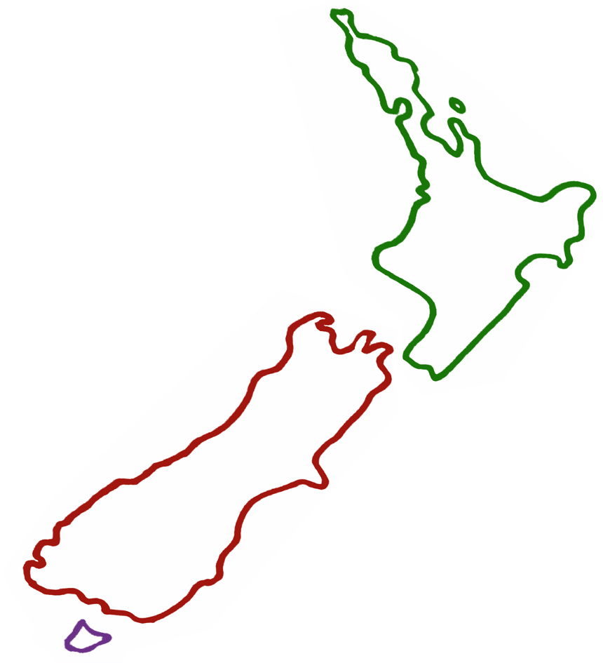

    

# Julia Users NZ

This site co-ordinates [Julia](https://julialang.org) events in New Zealand.

[Sign up for email updates!](https://forms.gle/tATgaAwgjjfP6Z5J7)

### Upcoming events

We hope to have a kick-off event in early December.

- Date     : early December
- Location : TBA
- Topic    : TBA

### Contact

- Join the [mailing list](https://forms.gle/tATgaAwgjjfP6Z5J7)

You can also find us at the `#new-zealand` channel on [Slack](http://julialang.slack.com)
and the `#new-zealand-local` channel on [Zulip](https://julialang.zulipchat.com/#narrow/stream/263467-new-zealand-local).

### Who uses Julia in NZ?

One reason for starting this group is to gain visibility into some of the cool
stuff people are doing with Julia in New Zealand.

- Oscar ([@odow](https://github.com/odow), Auckland) is a core contributor of
    [JuMP](https://jump.dev).
- Morten ([@mortenpi](https://github.com/mortenpi), Auckland) is a Ph.D. student
    at U. Massey, Albany, and maintains [Documenter.jl](https://github.com/JuliaDocs/Documenter.jl)
    as a side project.

### Previous meetings

... none yet ...

### Help improve this site

You can contribute to [this site on Github](https://github.com/julia-users-nz/julia-users-nz.github.io).
